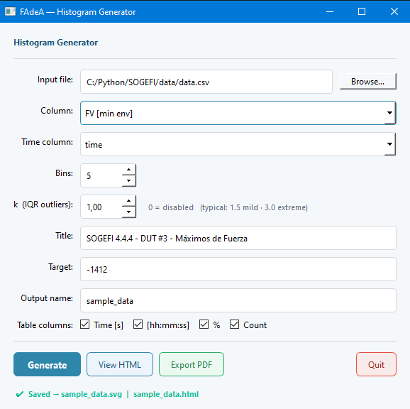
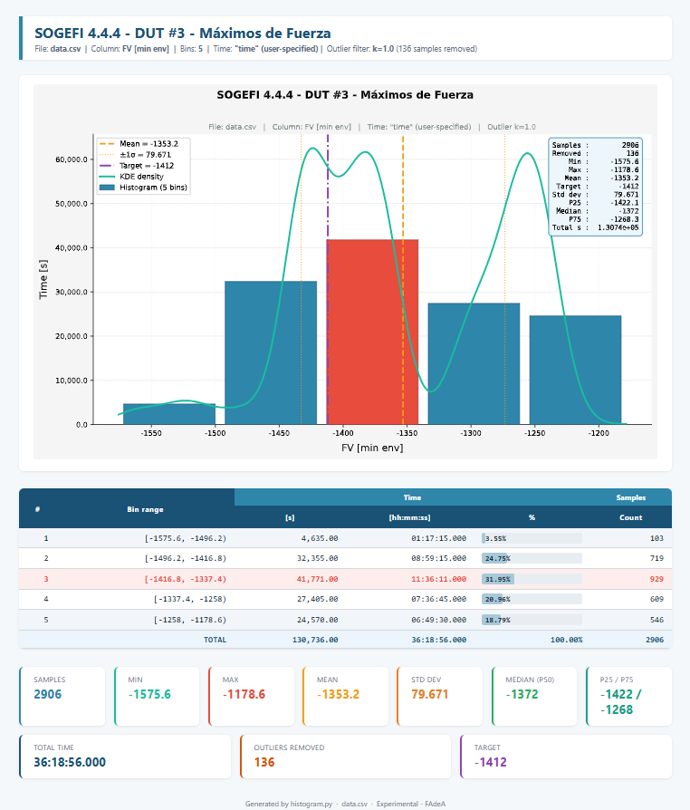

# Histogram FAdeA

Generador de histogramas profesionales a partir de archivos CSV, con ponderación temporal, detección automática de separador, remoción de outliers y exportación a SVG, HTML y PDF.

Desarrollado para **FAdeA — Fábrica Argentina de Aviones**.

---

## Pantallas

### Interfaz gráfica



### Reporte HTML generado



---

## Modos de uso

### Modo GUI (sin argumentos)

```powershell
python histogram.py
```

Se abre la interfaz gráfica. Todos los parámetros se configuran desde la ventana y se guardan automáticamente en `config.ini` para la próxima sesión.

### Modo CLI (línea de comandos)

```powershell
python histogram.py <columna> <archivo.csv> [opciones]
```

**Ejemplo:**

```powershell
python histogram.py "XZ [mean]" datos.csv t=time bins=30 k=1.5 target=150.0 title="Ensayo #1" out=reporte
```

---

## Campos de entrada

### GUI — Formulario principal

| Campo | Tipo | Descripción | Valor por defecto |
|---|---|---|---|
| **Input file** | Ruta de archivo | Archivo CSV de entrada. Acepta separadores `,` `;` `\t` `|` (detección automática). Botón **Browse…** para explorar. | — |
| **Column** | Lista desplegable | Columna del CSV a graficar. Se carga automáticamente al seleccionar el archivo. | Primera columna |
| **Time column** | Lista desplegable | Columna de tiempo para ponderar el histograma. Cada muestra se pesa por su Δt, de modo que el eje Y representa *tiempo en cada rango*. Opciones: `(auto-detect)` busca columnas llamadas `t`, `time` o `t[s]`; `(none)` desactiva la ponderación (Y = cantidad de muestras). | `(auto-detect)` |
| **Bins** | Entero (2–500) | Número de barras del histograma. | 20 |
| **k (IQR outliers)** | Decimal ≥ 0 | Multiplicador del rango intercuartil para remoción de outliers. Se eliminan los valores fuera de `[Q1 − k·IQR, Q3 + k·IQR]`. `0` = sin filtrado. Valores típicos: `1.5` (moderado), `3.0` (extremo). | 0 |
| **Title** | Texto libre | Título del gráfico y del reporte HTML. Si se omite, se usa `Histogram — <columna>`. | *(vacío)* |
| **Target** | Número decimal | Valor de referencia o especificación. Se dibuja como línea vertical violeta en el gráfico y aparece como tarjeta de estadística en el reporte. | *(vacío = sin target)* |
| **Output name** | Texto libre | Nombre base para los archivos de salida (sin extensión). Se generan `<nombre>.svg`, `<nombre>.png` y `<nombre>.html` en el mismo directorio que el CSV. Si se omite, el nombre se construye automáticamente como `<csv>_hist_<columna>`. | *(automático)* |
| **Table columns** | Checkboxes | Selecciona las columnas opcionales de la tabla de bins en el reporte HTML: **Time [s]** (tiempo ponderado en segundos), **[hh:mm:ss]** (formato horario), **%** (porcentaje), **Count** (cantidad de muestras). Las columnas `#` y `Bin range` son fijas. | Todas activas |

### CLI — Parámetros posicionales y opcionales

| Parámetro | Formato | Descripción |
|---|---|---|
| `columna` | posicional | Nombre exacto de la columna a graficar (entre comillas si tiene espacios). |
| `archivo.csv` | posicional | Ruta al archivo CSV. Si no tiene extensión, se agrega `.csv` automáticamente. |
| `t=<nombre>` | `clave=valor` | Nombre de la columna de tiempo. Si se omite, se aplica auto-detección. |
| `bins=<n>` | `clave=valor` | Número de bins (entero positivo). |
| `k=<valor>` | `clave=valor` | Multiplicador IQR para remoción de outliers (decimal ≥ 0). |
| `title=<texto>` | `clave=valor` | Título del gráfico y del reporte. |
| `target=<valor>` | `clave=valor` | Valor de referencia (línea vertical en el gráfico). |
| `out=<nombre>` | `clave=valor` | Nombre base de los archivos de salida (sin extensión). |

---

## Archivos generados

Por cada ejecución se generan tres archivos en el mismo directorio que el CSV de entrada (o con el nombre indicado en **Output name**):

| Archivo | Descripción |
|---|---|
| `<nombre>.svg` | Gráfico vectorial (sin pérdida de resolución). Incrustado en el HTML. |
| `<nombre>.png` | Gráfico raster 150 dpi. Usado internamente para la exportación a PDF. |
| `<nombre>.html` | Reporte completo: gráfico, tabla de bins y tarjetas de estadísticas. |
| `<nombre>.pdf` | Generado bajo demanda con el botón **Export PDF**. |

---

## Botones de acción

| Botón | Descripción |
|---|---|
| **Generate** | Ejecuta el cálculo y genera los archivos SVG, PNG y HTML. Se habilita al seleccionar un archivo válido. |
| **View HTML** | Abre el reporte HTML en el navegador por defecto del sistema. Se habilita tras la primera generación exitosa. |
| **Export PDF** | Convierte el HTML a PDF (vía xhtml2pdf) y lo abre en el visor PDF por defecto. Se habilita tras la primera generación exitosa. |
| **Quit** | Cierra la aplicación. |

---

## Contenido del reporte HTML

El reporte contiene las siguientes secciones, en este orden:

1. **Encabezado** — título, nombre del archivo, columna, número de bins, columna de tiempo y filtro de outliers activo.
2. **Gráfico** — histograma con KDE superpuesta, líneas de media, ±1σ y target (si se especificó).
3. **Tabla de bins** — detalle por intervalo con las columnas seleccionadas (tiempo, porcentaje, cantidad).
4. **Tarjetas de estadísticas** — Samples, Min, Max, Mean, Std dev, Median, P25/P75, Total time (si hay columna temporal), Outliers removed (si k > 0), Target (si se especificó).

---

## Instalación y entorno

### Requisitos

- Python 3.8 o superior
- Windows 7 SP1+ / Windows 10+ (para Windows 7 se requiere el parche KB2999226)

### Instalación desde fuentes

```powershell
python -m venv .venv
.venv\Scripts\activate
pip install -r requirements.txt
python histogram.py
```

### Instalación desde el instalador

Ejecutar `HistogramFAdeA_Setup_v1.0.exe` y seguir el asistente. No requiere Python instalado en el equipo destino.

---

## Dependencias

| Biblioteca | Uso |
|---|---|
| `numpy` / `pandas` | Carga y procesamiento de datos CSV |
| `matplotlib` | Generación del gráfico (backend Qt5Agg) |
| `scipy` | Estimación de densidad KDE (gaussian_kde) |
| `PyQt5` | Interfaz gráfica |
| `xhtml2pdf` | Exportación a PDF |

---

*Experimental — FAdeA*  
Bugs: reportar a [Eng. Marcelo Valdez](mailto:mvaldez@fadeasa.com.ar)
